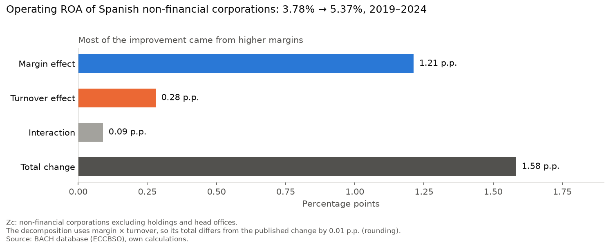
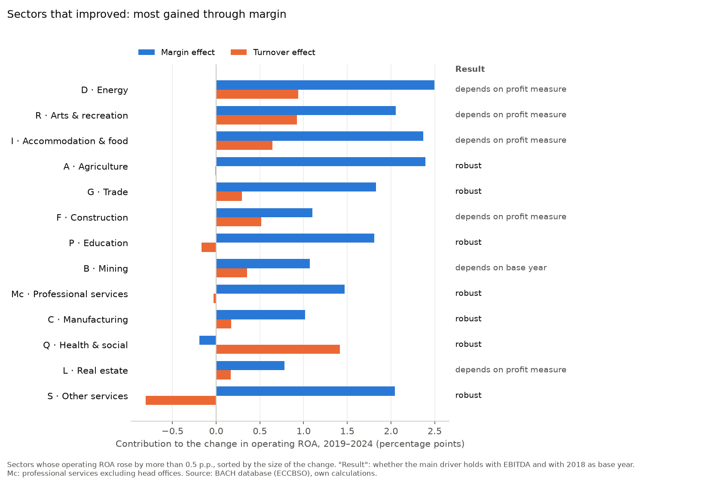

# Margin or efficiency? A DuPont decomposition of Spanish corporate returns, 2019–2024

Did the Spanish sectors that improved their returns between 2019 and 2024 do it by **charging more** (higher margins) or by **using their assets better** (higher asset turnover)?

The difference matters. Margin gains depend on pricing power or cost control, and tend to erode when competition arrives or demand softens. Efficiency gains — more sales from the same asset base — tend to be more durable.

## Key findings

**1. Returns improved, and mostly through margins.** The operating ROA of Spanish non-financial corporations rose from **3.78% in 2019 to 5.37% in 2024**. About three quarters of the improvement (**77%**) came from higher margins and less than a fifth (**18%**) from better asset turnover.



**2. The same pattern holds across sectors.** 13 of the 17 sectors analysed improved by more than 0.5 percentage points. In 12 of them the margin effect is larger than the turnover effect; only health and social work (Q) improved mainly through asset turnover.

**3. But the answer is only robust for about half of them.** The result for each sector was re-tested with a different base year (2018) and a different profit measure (EBITDA):

| Result | Sectors |
|---|---|
| Improved through margin, robust to both checks | Agriculture (A), Manufacturing (C), Trade (G), Professional services (Mc), Education (P), Other services (S) |
| Improved through asset turnover, robust to both checks | Health and social work (Q) |
| Depends on the profit measure | Energy (D), Construction (F), Accommodation and food (I), Real estate (L), Arts and recreation (R) |
| Depends on the base year | Mining (B) |



**4. Margin and turnover are not independent.** The five sectors that depend on the profit measure are those where asset turnover rose sharply (9 to 15 points in D, F, I and R) or where a very high EBITDA margin amplifies it (L). Selling more from the same assets spreads depreciation over more sales, which raises the margin *after* depreciation. So the same gain shows up as margin when profit is measured after depreciation, and as turnover when it is measured before (EBITDA).

**What it means.** If margin gains are the less durable kind, a large part of the 2019–2024 improvement in Spanish corporate returns is of the type most exposed to reversal. This is a reading of the DuPont framework, not something the data prove — and "margin" covers both higher prices and lower costs, which this data cannot tell apart.

## Why this question

The Observatorio de Márgenes Empresariales, a joint project of the Spanish Ministry of Economy, Banco de España and the Tax Agency (AEAT), tracks business margins on sales. Margins show how much of each euro of revenue becomes profit, but not how much revenue companies generate from their assets. Relating profit to assets, and splitting its change into margin and asset efficiency, requires balance-sheet data, which the BACH database provides.

## Data

**Source:** BACH database (Bank for the Accounts of Companies Harmonised), maintained by the European Committee of Central Balance-Sheet Data Offices (ECCBSO). Spanish data are provided by Banco de España.

- **Scope:** Spain, non-financial corporations, by NACE section, 2018–2024. Extracted on 15 September 2026.
- **Coverage:** BACH's Spanish sample covers 49% of non-financial companies and 68% of their employment (2024).
- **Variable sample:** all companies with a balance sheet in each year.
- **Not included in this repository.** BACH's conditions of use prohibit redistribution of the data. See [How to reproduce](#how-to-reproduce).

## Method

**DuPont identity.** Operating ROA is the product of margin and asset turnover:

```
Operating ROA  =  Operating margin  ×  Asset turnover
Net operating profit / Total assets  =  Net operating profit / Net turnover  ×  Net turnover / Total assets
```

Using BACH's published ratios (weighted means, i.e. ratios of sector totals):

| | BACH ratio | Definition |
|---|---|---|
| Operating margin | R34 | Net operating profit / Net turnover |
| Asset turnover | R41 | Net turnover / Total assets |
| Operating ROA | R39 | Net operating profit / Total assets |

R34 and R39 share the same numerator, so the identity closes exactly. It was validated on the data: margin × turnover reproduces the published ROA to within 0.01 percentage points (rounding). BACH's own "EBIT" ratio (R35) could not be used, because BACH publishes no EBIT / Total assets ratio.

**Decomposition of the change.** With margin *M* and turnover *T*, from 2019 (0) to 2024 (1):

```
ΔROA  =  ΔM × T₀  +  M₀ × ΔT  +  ΔM × ΔT
         margin      turnover    interaction
         effect      effect
```

The interaction term is shown separately rather than allocated to either effect. A sector's main driver is the effect with the larger absolute size.

**Methodological choices:**

- **Profit measure:** net operating profit — after depreciation, provisions and impairments, and excluding financial and extraordinary items. The question is about using assets well, so the cost of owning those assets belongs in the profit measure.
- **Assets:** closing total assets, as published by BACH.
- **Base year:** 2019, the last pre-pandemic year. Starting in 2020 would measure the rebound from the pandemic trough rather than any structural change.
- **Sector level:** NACE sections. Divisions are nested within sections and are not mixed in.
- **Head offices excluded.** Head offices (NACE M701) hold 26% of total assets but only 0.1% of turnover. Their assets are typically shares in other companies of their group, whose operating assets are already counted in their own sectors, so including them double-counts assets. The whole-economy figure therefore uses BACH's `Zc` aggregate, and section M is replaced by `Mc` (M excluding head offices, which hold 88% of M's assets).
- **Threshold:** changes smaller than 0.5 percentage points are treated as no change. This is a judgement call, not a statistical test.

## Robustness

- **Base year 2018 instead of 2019.** The main driver changes only in Water and waste (E), which declined in both cases. Mining (B) improves from 2019 but declines from 2018: its 2019 was an unusually weak year, so its improvement is largely a recovery.
- **EBITDA instead of net operating profit.** The main driver switches from margin to turnover in five sectors (D, F, I, L, R). The switch is clear in Energy and Arts and recreation; in the other three the two effects are almost equal under EBITDA. See finding 4 for the mechanism.

## Limitations

- **Sample composition.** The variable sample is not the same set of companies each year. BACH itself warns that for countries without an exhaustive survey, such as Spain, "the composition of the sample population is changing every year", and recommends its sliding samples (the same companies in two consecutive years) for analysing evolutions. This analysis uses the variable sample; the 0.5 p.p. threshold and the base-year check mitigate the issue but do not measure it. A chained analysis on the sliding samples would.
- **Coverage.** The sample covers about half of Spanish non-financial companies. Conclusions apply to the companies BACH observes, not necessarily to all companies.
- **Aggregates hide dispersion.** Sector ratios are weighted by size. A sector can improve while its typical company does not.
- **Correlation is not causation.** Rising margins during a period of high inflation are consistent with firms passing costs on to prices, but the data do not show it. Changes in product mix, cost control and sector composition are alternative explanations.
- **Sector-specific shocks.** Some sectors were hit by one-off events in the period, such as energy (D) in 2022.
- **Book assets are not economic assets.** Sectors with large intangible assets that are not on the balance sheet show artificially high asset turnover.
- **Head offices.** Excluding them removes double-counted assets, but also the real management activity they perform, which is small in turnover terms (0.1%).

## How to reproduce

1. Open the BACH export page: <https://www.bach.banque-france.fr/#/pages/bach/base-bach/base-bach-export>
2. **Step 1:** country *Spain*; years *2018–2025*; all five size classes; *variable* and *sliding* samples; *All sections, with all the divisions*.
3. **Step 2:** all *Profitability ratios* and *Activity and technical ratios*; in *Amount choice*, total assets, turnover, gross value added, employees and number of companies; all value choices (weighted mean, median, quartiles). Export settings: decimal *point*, one column per *amount or ratio*.
4. Save the CSV in `data/raw/bach/`. The notebook reads `export-bach_2026-09-15-13-14-31.csv`; rename your file or update the path in section 2 of the notebook.
5. Install the dependencies and run the notebook top to bottom:

```
pip install -r requirements.txt
jupyter notebook notebooks/dupont_analysis.ipynb
```

BACH revises its data, so a later download may produce slightly different figures.

## Repository structure

```
├── README.md
├── requirements.txt
├── notebooks/
│   └── dupont_analysis.ipynb       Full analysis: load, validation, decomposition, robustness, figures
├── figures/
│   ├── fig1_whole_economy.png
│   └── fig2_sectors.png
└── data/raw/bach/                  BACH export (not included)
```

## Data citation

BACH database: ECCBSO, Oesterreichische Nationalbank, National Bank of Belgium, Deutsche Bundesbank, Banco de España, Banque de France, Hrvatska Narodna Banka, Magyar Nemzeti Bank, Centrale dei Bilanci - Cerved srl / Banca d'Itália, Statec Luxembourg, Narodowy Bank Polski (calculations of Narodowy Bank Polski on the basis of the data from the Statistics Poland), Banco de Portugal, National Bank of Slovakia (calculations based on data from the Ministry of Finance).
